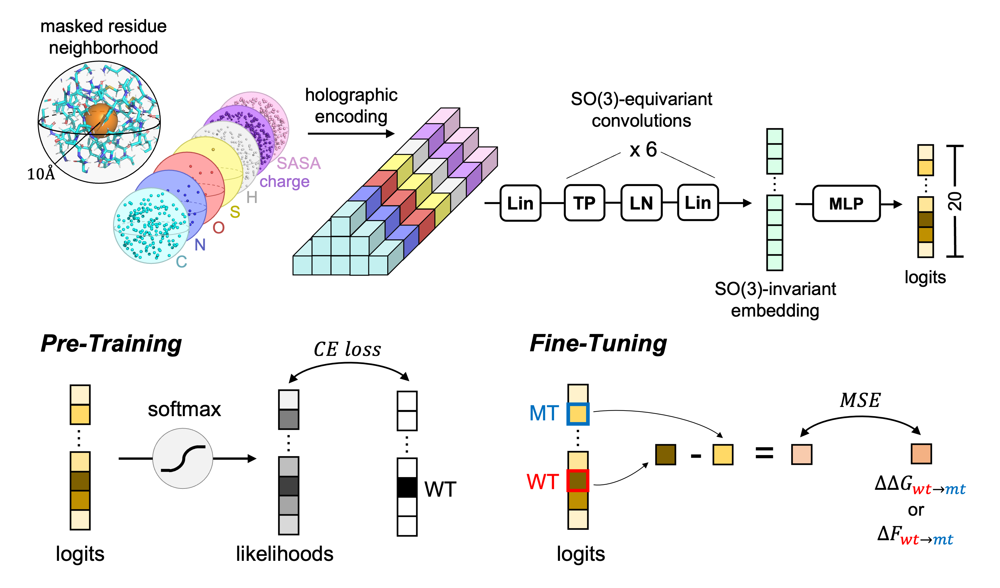

# HERMES: Holographic Equivariant neuRal network model for Mutational Effect and Stability prediction

Code for the paper [HERMES: Holographic Equivariant neuRal network model for Mutational Effect and Stability prediction](https://www.biorxiv.org/content/10.1101/2024.07.09.602403v1.full).




## Running on Colab

**We are in the process of updating the colab notebook, see the old version, which includes only pre-trained models and models fine-tuned on Rosetta ddG data [here](https://colab.research.google.com/drive/1JQxkXeGZJYYcPNglN3rYUYiOuUOkwJPL?usp=sharing)**


## Installing and running locally

NOTE: Currently, the installation of the `zernikegrams` package appears to take a very long time (~hours) on our HPC cluster, after installing `pytorch` with CUDA support. Please bear with us as we figure out a better installation procedure. The installation seems to work fine on Google Colab, which makes us think it might be a platform-dependent issue. In any case, if you're only interested in running inference using our already-trained models, running on CPU only is sufficient.

**Step 1:** Create environment.
```bash
conda create -n hermes python=3.10
conda activate hermes
```

Install `pytorch` with or without CUDA depending on whether you have a GPU available, following https://pytorch.org/get-started/previous-versions/. For example:
```bash
conda install pytorch torchvision torchaudio pytorch-cuda -c pytorch -c nvidia # with cuda for gpu support
conda install pytorch torchvision torchaudio cpuonly -c pytorch # cpu only
```

**Step 2:** Install `pytorch` and the `zernikegrams` package, which we use for protein preprocessing. We recommend installing the two together to give conda an easier time working through version conflicts. See [here](https://pytorch.org/get-started/previous-versions/) for more details on installing `pytorch` and [here](https://github.com/StatPhysBio/zernikegrams) for more details on the `zernikegrams` package.
```bash
conda install zernikegrams pytorch-cuda -c statphysbio -c conda-forge -c bioconda -c pytorch -c nvidia # this will install pytorch with GPU support
```


**(Optional) Step 3:** Install pyrosetta. This is required for the use of models trained on structures processed using pyrosetta. A license is available at no cost to academics and can be obtained [here](https://www.pyrosetta.org/home/licensing-pyrosetta). We are aware of the limitations posed by pyrosetta's license and are working on releasing a version that uss biopython instead and other open source code soon.

To download pyrosetta, after obtaining a license from the link above, follow instructions [here](https://www.pyrosetta.org/downloads#h.6vttn15ac69d). We recommend downloading the .whl file and installing with pip. Our models were trained and evaluated using version `PyRosetta4.Release.python39.linux.release-335`. We do not foresee issues with using alternative versions, but cannot guarantee compatibility at this time.


**Step 4:** Install `hermes` as a package. This will install some of the other necessary packages as well.
```bash
pip install .
```


Feel free to use `pip install -e .` instead if you plan on making changes to the code and want to test them without reinstalling the package.


Installation tips:
1. The error `{ENVIRONMENT_PATH}/bin/../lib/libstdc++.so.6: version 'GLIBCXX_3.4.30' not found`, as required by OpenMM, can be fixed via `conda install -c conda-forge libstdcxx-ng`. See https://stackoverflow.com/questions/48453497/anaconda-libstdc-so-6-version-glibcxx-3-4-20-not-found
2. Somehow can't install pdbfixer AFTER conda


## Provided pre-trained and fine-tuned models

You can find all the models in the `trained_models/` directory. Some notable models:

- `hermes_{bp/py}_{000/050}`: Pre-trained for masked amino-acid classification on ~10k CASP12 ProteinNet chains.
- `hermes_{bp/py}_{000/050}_ft_ros_ddg_st`: Pre-trained for masked amino-acid classification on ~10k CASP12 ProteinNet chains. Then fine-tuned to regress ddG values of stability for 35 proteins computed with Rosetta.
- `hermes_{bp/py}_{000/050}_ft_cdna117k_ddg_st`: Pre-trained for masked amino-acid classification on ~10k CASP12 ProteinNet chains. Then fine-tuned to regress ddG values of stability from the cdna117k dataset. *These are the best models for protein stability prediction*.
- `hermes_{bp/py}_{000/050}_ft_skempi_ddg_bi`: Pre-trained for masked amino-acid classification on ~10k CASP12 ProteinNet chains. Then fine-tuned to regress ddG values of binding for the SKEMPI dataset. *Use these for predicting mutation effects on binding.*.

`bp` indicates Biopython preprocessing (open source but slower), whereas `py` indicates PyRosetta preprocessing (faster but requires a license). `000` indicates no noise added during training, whereas `050` indicates noise was added during training. `ft` indicates the model was fine-tuned on a specific dataset. `ros_ddg_st` indicates the model was fine-tuned on Rosetta ddG stability data. `cdna117k_ddg_st` indicates the model was fine-tuned on the cdna117k ddG stability data. `skempi_ddg_bi` indicates the model was fine-tuned on the SKEMPI ddG binding data.

Please see the paper for a comprehensive benchmarking evaluation.

Note that, to use the pyrosetta models, a local installation of pyrosetta is necessary, whereas the biopython models use a fully open-source pipeline.


## Getting site-level mutation probabilities and embeddings for all sites in PDB files

The script `run_hermes_on_pdbfiles.py` can be given as input a set of PDB files - with optionally pdb-specific chains - and it will output a csv file where every row is a uniquely-identified site, and columns are the site's mutation probabilities. If embeddings are requested, they will be outputted in a separate file called `{CSV_FILENAME}-embeddings.npy`.

```bash
usage: run_hermes_on_pdbfiles.py [-h] -m MODEL_VERSION [-hf HDF5_FILE] [-pd FOLDER_WITH_PDBS] [-pn FILE_WITH_PDBIDS_AND_CHAINS] [-pp PARALLELISM] -o OUTPUT_FILEPATH
                                 [-r {logprobas,probas,embeddings,logits} [{logprobas,probas,embeddings,logits} ...]] [-an {0,1}] [-el {0,1}] [-bs BATCH_SIZE] [-v {0,1}] [-lb {0,1}]

optional arguments:
  -h, --help            show this help message and exit
  -m MODEL_VERSION, --model_version MODEL_VERSION
                        Name of HERMES model you want to use.
  -hf HDF5_FILE, --hdf5_file HDF5_FILE
                        Path to an .hdf5 file containing zernikegrams and res_ids to run inference on. Cannot be specified together with --folder_with_pdbs.
  -pd FOLDER_WITH_PDBS, --folder_with_pdbs FOLDER_WITH_PDBS
                        Directory containing PDB files to run inference on. Inference is run on all sites in the structure. Cannot be specified together with --hdf5_file.
  -pn FILE_WITH_PDBIDS_AND_CHAINS, --file_with_pdbids_and_chains FILE_WITH_PDBIDS_AND_CHAINS
                        [Optional] Path to a .txt file containing pdbids and chains to run inference on. If not specified, and --folder_with_pdbs is specified, inference will be run on all sites in the structure. If specified, each
                        line should be in the format "pdbid chain"; if chain is not specified for a given line, inference will be run on all chains in that structure.
  -pp PARALLELISM, --parallelism PARALLELISM
                        If zero (default), pdb files are processed one by one. If one, pdb files are processed in parallel with specified parallelism (and number of cores available), by first generating zernikegrams in a temporary
                        hdf5 file.
  -o OUTPUT_FILEPATH, --output_filepath OUTPUT_FILEPATH
                        Must be a ".csv file". Embeddings will be saved separately, in a parallel array, with the same filename but with the extension "-embeddings.npy".
  -r {logprobas,probas,embeddings,logits} [{logprobas,probas,embeddings,logits} ...], --request {logprobas,probas,embeddings,logits} [{logprobas,probas,embeddings,logits} ...]
                        Which data to return. Can be a combination of "logprobas", "probas", "embeddings", and "logits".
  -an {0,1}, --add_same_noise_level_as_training {0,1}
                        1 for True, 0 for False. If True, will add the same noise level as was used during training. This is useful for debugging purposes. Default is False.
  -el {0,1}, --ensemble_at_logits_level {0,1}
                        1 for True, 0 for False. When computing probabilities and log-probabilities, ensembles the logits before computing the softmax, as opposed to ansembling the individual models' probabilities. There should not
                        be a big difference, unless the ensembled models are trained very differently.
  -bs BATCH_SIZE, --batch_size BATCH_SIZE
                        Batch size for the model (number of sites). Higher batch sizes are faster, but may not fit in memory. Default is 512.
  -v {0,1}, --verbose {0,1}
                        0 for no, 1 for yes. Currently, "yes" will print out accuracy of the model on the data.
  -lb {0,1}, --loading_bar {0,1}
                        0 for no, 1 for yes.
```


Some common use cases:

**Get all probabilities and embeddings for all sites in the PDB files found in `pdbs`.**
```bash
python run_hermes_on_pdbfiles.py -pd pdbs -m hermes_bp_000 -o all_sites.csv -r probas embeddings
```
The above command will output two csv files: one called `all_sites.csv` with mutation probabilities, the other called `all_sites-embeddings.npy` with embeddings, for all sites in the PDB files found in the `pdbs` directory.

**Request to process specific pdbs and chains.**
The requested pdbs and chains should be listed in a text file, with one pdb and, optionally, a *single* chain per line. If the chain is not specified, then all chains are considered. To consider multiple chains, list the pdb multiple times with each different chain. Note that we DO NOT delete the atoms of the non-requested chains.
For example, assume the file `my_pdbs_and_chains.txt` contains the following:
```
1ao7
1qrn A
1qrn B
```
Then, to process only these pdbs and chains, run:
```bash
python run_hermes_on_pdbfiles.py -pd pdbs -pn my_pdbs_and_chains.txt -m hermes_bp_000 -o specific_chains.csv -r probas embeddings
```

If a requested pdb file is not found in the directory, the script will automatically attempt to download it from the RCSB website.

**New from 08/05/24 - Parallel processing with multiprocessing.**
We now support processing proteins in parallel over multiple cores, leveraging the `multiprocessing` library. To use this feature, first make sure your program has access to the desired number of cores, then provide the `-pp` argument with the number of cores you want to use. Crucially, this will parallelize only the processing and parsiong of proteins, not the forward pass to the model. Furthermore, note that `multiprocessing` has some significant overhead, so the time improvement is less than linear with the number of cores and, in some cases, using multiprocessing might even be slower than not parallelizing at all. If you do not want to use multiprocessing, use the default value `-pp 0`, as specifying `-pp 1` will still call multiprocessing and be slower. \\
Below are the times to run `hermes_bp_000` on 15 PDBs using a single A40 GPU, and access to 5 cores with 64GB total of memory, and with varying degrees of parallelization:

| `-pp` | Time (s) |
| ----- | -------- |
| 0     |  514     |
| 1     |  628     |
| 2     |  367     |
| 3     |  332     |


**New from 08/05/24 - Parallel processing with SLURM.**
A more efficient option for parallel processing, which however requires more code to set up, is to call the script `run_hermes_on_pdbfiles.py` in parallel on subsets of the PDB files and then merge the results. This is most convenient when using a job scheduler like SLURM. We provide a script that automatically runs all HERMES models on all PDB files in a directory, by submitting a single-core job per PDB-model combination. It is the responsibility of the user to then merge the results if they so desire. The script it easily modifiable and we invite the experienced users to modify it to their needs. The script is called `run_hermes_on_pdbfiles_in_parallel_with_slurm.py`:
```bash
usage: run_hermes_on_pdbfiles_in_parallel_with_slurm.py [-h] -m MODEL_NAME [-pd FOLDER_WITH_PDBS] [-df DUMPFILES_FOLDER] [-of OUTPUT_FOLDER] [-hf HERMES_FOLDER] [-bs BATCH_SIZE] [-A ACCOUNT] [-P PARTITION] [-G {0,1}] [-C NUM_CORES]
                                                        [-W WALLTIME] [-M MEMORY] [-E {0,1}] [-EA EMAIL_ADDRESS]

optional arguments:
  -h, --help            show this help message and exit
  -m MODEL_NAME, --model_name MODEL_NAME
  -pd FOLDER_WITH_PDBS, --folder_with_pdbs FOLDER_WITH_PDBS
                        Directory containing PDB files to run inference on. Inference is run on all sites in the structure.
  -df DUMPFILES_FOLDER, --dumpfiles_folder DUMPFILES_FOLDER
                        Root to store dumpfiles.
  -of OUTPUT_FOLDER, --output_folder OUTPUT_FOLDER
                        Root to store outputs.
  -hf HERMES_FOLDER, --hermes_folder HERMES_FOLDER
                        Path to the HERMES folder, containing the run_hermes_on_pdbfiles.py script.
  -bs BATCH_SIZE, --batch_size BATCH_SIZE
  -A ACCOUNT, --account ACCOUNT
  -P PARTITION, --partition PARTITION
  -G {0,1}, --use_gpu {0,1}
  -C NUM_CORES, --num_cores NUM_CORES
  -W WALLTIME, --walltime WALLTIME
  -M MEMORY, --memory MEMORY
  -E {0,1}, --send_emails {0,1}
  -EA EMAIL_ADDRESS, --email_address EMAIL_ADDRESS
```


## Scoring specific mutations

Sometimes, it is useful to score specific mutations. The script `mutation_effect_prediction_with_hermes.py` can be used for this purpose. It takes as input a csv file with columns corresponding to: the mutation, the chain, and the pdb file of the wildtype. The script will output a csv file with the mutation probabilities and embeddings for the requested mutations.

If desired, the script supports the use of the mutant structure to predict the mutation effect. This can be done by providing the mutant pdb file in the csv file in the appropriate column.

The columns are not expected to have specific names, but the names must ben provided as input to the script.

Run `python mutation_effect_prediction_with_hermes.py -h` for more information on the script, and see `experiments/Protein_G/` for a simple example.

Note that, for simplicity, the script assumes empty insertion codes. In `hermes/utils/rename_resnums.py` we provide a function `rename_resnums()` that uses BioPython to sequentially rename the resnums in a pdb file, removing insertion codes, and also saves a mapping between the new resnums, and the old resnums+icodes.


## Want to fine-tune on your mutation effect dataset?

Fine-tuning can be easily done in three steps.

1. **Prepare the data.** Prepare the targets in three .csv files, which must have `{train}`, `{valid}`, and `{test}` in the name. Each .csv file must have the following columns: `[pdbid, chainid, variant, score]`. Also, place all the pdbfiles for training, validation and testing in a single directory.

2. **Generate inputs (aka zernikegrams or holograms).** For faster training, we pre-generate the inputs and store them in a .npz file. Run `make_zernikegrams_for_finetuning.py` to generate the inputs, providing as arguments, the model you want to make inputs for, the directory of pdbfiles, whether to add noise to structures, and the output directory.

3. **Fine-tune the model.** Run `finetune_hermes.py` to fine-tune the model. You need to provide a config file with the necessary information, see `/gscratch/spe/gvisan01/hermes/training_data/finetuning/cdna117k/configs/hermes_bp_000.yaml` for a thorough example.


## References

**TODO: update reference with MLSB paper**

If you use this code, please cite the following paper:

```
@article {visani_hermes_2024,
	author = {Visani, Gian Marco and Pun, Michael N. and Galvin, William and Daniel, Eric and Borisiak, Kevin and Wagura, Utheri and Nourmohammad, Armita},
	title = {HERMES: Holographic Equivariant neuRal network model for Mutational Effect and Stability prediction},
	elocation-id = {2024.07.09.602403},
	year = {2024},
	doi = {10.1101/2024.07.09.602403},
	publisher = {Cold Spring Harbor Laboratory},
	URL = {https://www.biorxiv.org/content/early/2024/07/13/2024.07.09.602403},
	eprint = {https://www.biorxiv.org/content/early/2024/07/13/2024.07.09.602403.full.pdf},
	journal = {bioRxiv}
}
```


